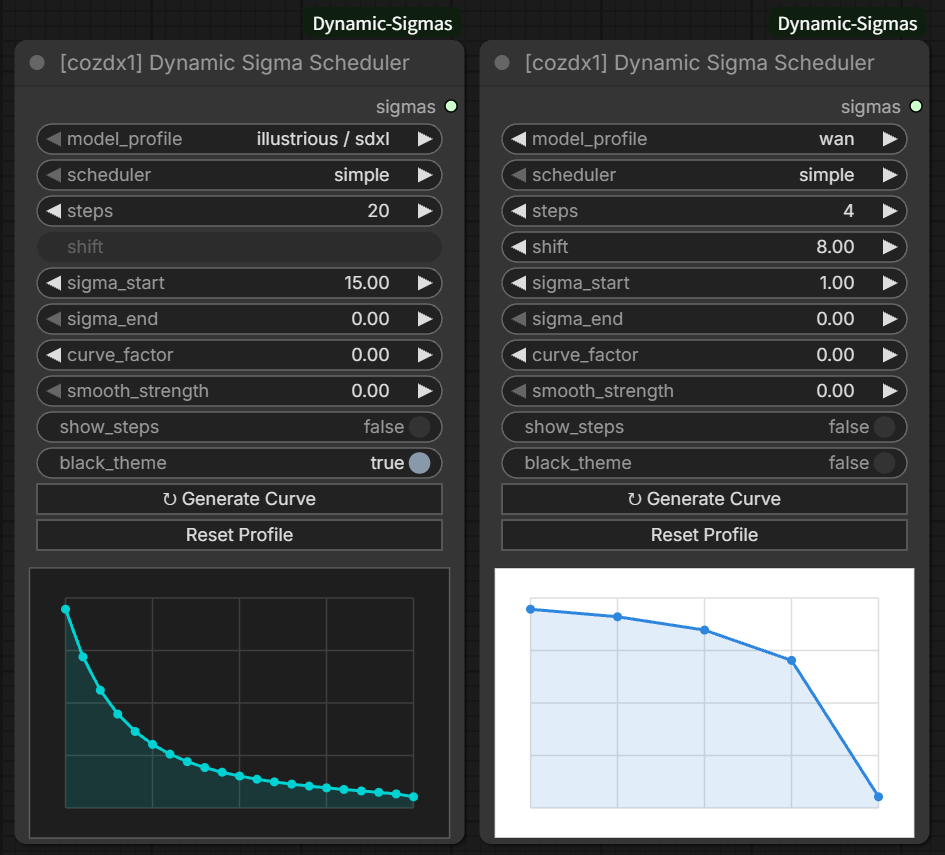
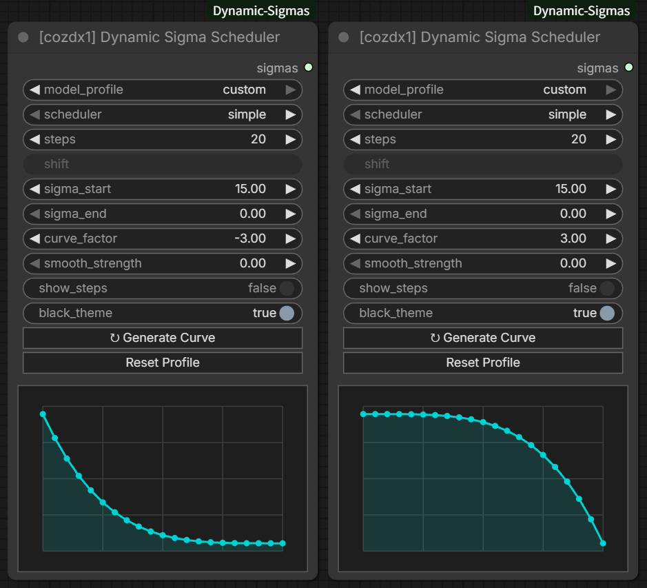
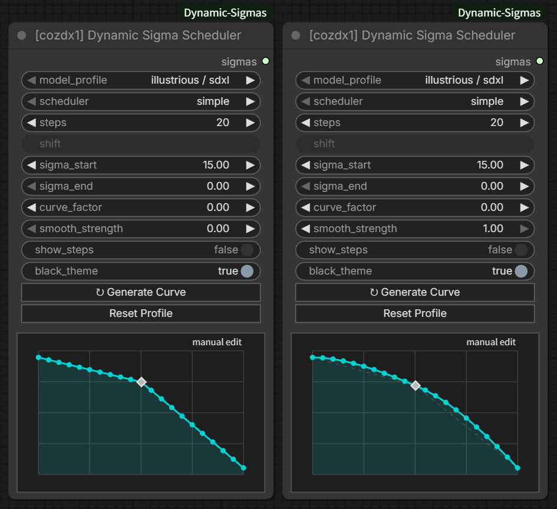
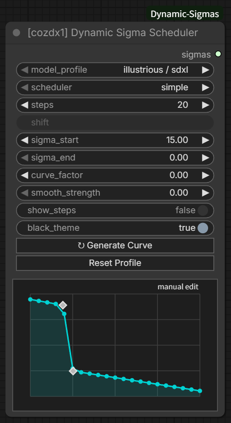
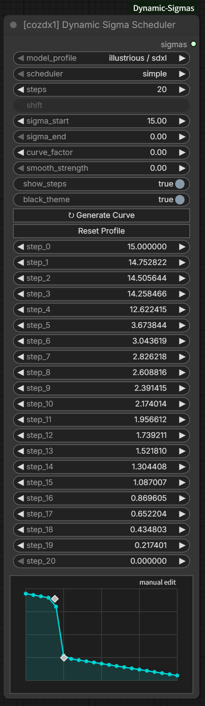
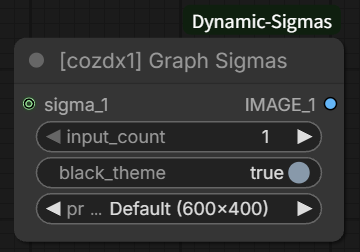
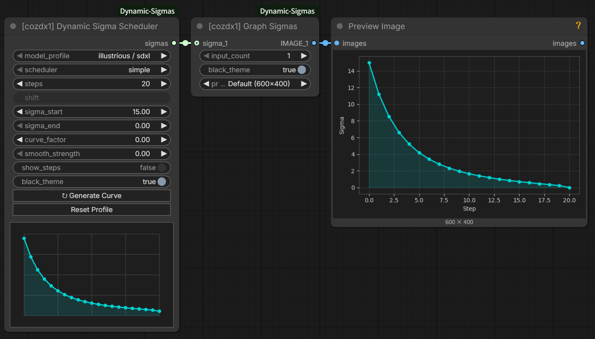
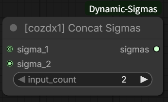
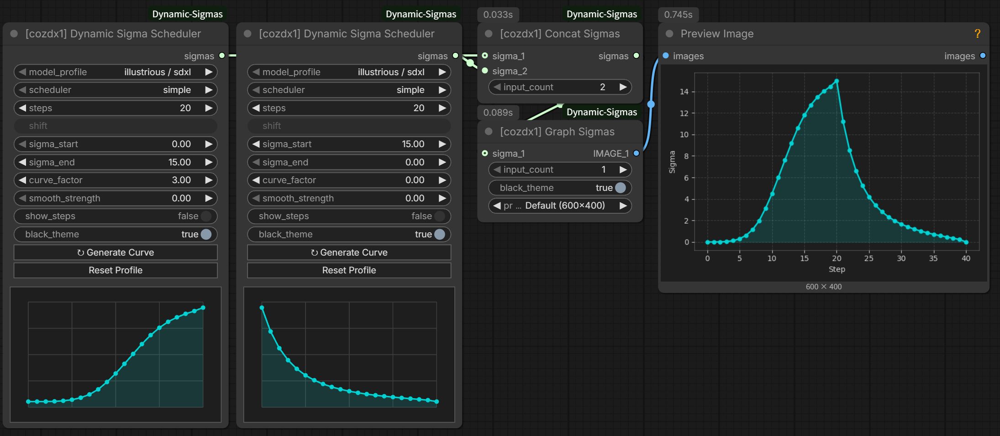
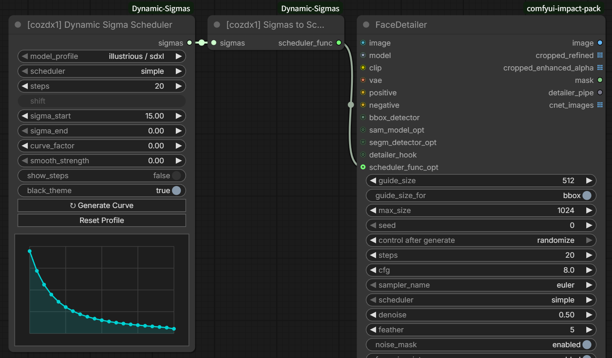

# ComfyUI Dynamic Sigmas

[English](README.md) | [한국어](README.ko.md)

Create, reshape, inspect, combine, and reuse custom sigma schedules in ComfyUI. Model-family profiles provide practical starting curves without requiring a `MODEL` connection, while every resulting schedule remains editable.

Search for `cozdx1` in the node menu to find all four nodes.

<p align="center">
  
</p>

<p align="center"><sub>Illustrious/SDXL in the dark editor and WAN in the light editor.</sub></p>

## What's new in v1.1.0

- Profiles for Illustrious/SDXL, Anima, WAN, LTXV, Z-Image, Qwen-Image, Flux2, Krea2, and Custom.
- Real-time previews for 11 schedulers, including `beta57` and `bong_tangent`.
- Editable graph endpoints, per-step values, curve shaping, and adjustable monotone smoothing.
- Graph Sigmas output presets from 450×300 to 1200×800 with resolution-aware styling.
- A compact `SIGMAS` to `SCHEDULER_FUNC` bridge for compatible Detailers and sampler nodes.
- Korean localization, in-app documentation, and migration for workflows saved with v1.0.x.

## Quick start

1. Add **[cozdx1] Dynamic Sigma Scheduler**.
2. Choose a model profile, scheduler, and step count.
3. Adjust the endpoints or shape, or edit the graph directly.
4. Connect `sigmas` to a compatible sampler, Graph Sigmas, Concat Sigmas, or Sigmas to Scheduler Func.

Profiles are starting points, not model auto-detection. Check the appropriate sigma range for the model, sampler, and workflow you are using.

## Nodes

### [cozdx1] Dynamic Sigma Scheduler

Builds a `SIGMAS` tensor and previews it immediately, before the queue runs. The output always contains `steps + 1` values because both endpoints are included.

#### Model profiles

| Profile | Sampling family | Default shift | Default start |
|---|---|---:|---:|
| `illustrious / sdxl` | SDXL discrete | — | `15.0` |
| `anima` | Discrete Flow | `3.0` | `1.0` |
| `wan` | Discrete Flow | `8.0` | `1.0` |
| `ltxv` | Flux | `2.37` | `1.0` |
| `z-image` | Discrete Flow | `3.0` | `1.0` |
| `qwen-image` | Flux | `1.15` | `1.0` |
| `flux2` | Flux | `2.02` | `1.0` |
| `krea2` | Flux | `1.15` | `1.0` |
| `custom` | Manual | — | Keeps the current values |

Changing a profile selects its sampling family and default shift/endpoints. Select `custom` when you want to keep the current values and shape the schedule manually. Flow shift is disabled for Illustrious/SDXL and Custom.

#### Supported schedulers

`simple`, `sgm_uniform`, `karras`, `exponential`, `ddim_uniform`, `beta`, `beta57`, `normal`, `linear_quadratic`, `kl_optimal`, and `bong_tangent`.

#### Shape controls

- `sigma_start` / `sigma_end`: Set the first and final values. Intermediate endpoints can be useful when schedules will be concatenated.
- `curve_factor`: Positive values hold higher sigmas longer; negative values make them fall earlier.
- `smooth_strength`: Blends manually edited sections from linear (`0`) to monotone cubic (`1`) without adding a rise between monotone control points.
- `show_steps`: Shows all sigma values as editable six-decimal widgets. These widgets can also be converted to inputs.
- `black_theme`: Changes only the editor theme.
- **Generate Curve**: Discards manual edits and regenerates the curve from the current controls.
- **Reset Profile**: Restores the selected profile's default shift and endpoints as well as its curve.

<p align="center">
  
</p>

<p align="center"><sub>Negative and positive <code>curve_factor</code> values move the curve in opposite directions.</sub></p>

<p align="center">
  
</p>

<p align="center"><sub><code>smooth_strength</code> blends a manual curve from linear interpolation to monotone cubic interpolation.</sub></p>

#### Manual editing

Click an empty graph position to add a control point, then drag it to reshape the curve. Shift-click a custom point to remove it. The first and last graph points stay synchronized with `sigma_start` and `sigma_end`.

| Direct graph editing | Editable per-step values |
|:---:|:---:|
|  | <a href="docs/images/editable-step-values.png"></a> |
| Add and drag control points. | Enable `show_steps` to edit exact values. Click to view the full-size image. |

The emitted schedule is a one-dimensional `float32` tensor.

### [cozdx1] Graph Sigmas

Renders each connected sigma schedule as a ComfyUI `IMAGE`. Increase `input_count` to add matching `SIGMAS` inputs and `IMAGE` outputs.

<p align="center">
  
</p>

- `black_theme`: Selects a dark or light plot.
- `preview_resolution`: Selects Compact (450×300), Default (600×400), Large (900×600), or High (1200×800).
- Labels, strokes, markers, and spacing scale with the selected resolution. Existing workflows retain the 600×400 default.

<p align="center">
  
</p>

### [cozdx1] Concat Sigmas

Joins connected schedules in numeric input order. Increase `input_count` to add inputs.

<p align="center">
  
</p>

The final value of each non-final schedule is removed so a shared boundary is not duplicated. For example, `[1.0, 0.5]` followed by `[0.5, 0.0]` becomes `[1.0, 0.5, 0.0]`.

<p align="center">
  
</p>

<p align="center"><sub>Concat Sigmas joins multiple sigma sequences into one schedule.</sub></p>

Concat Sigmas does not alter values or force adjacent endpoints to match. Set the boundaries intentionally when a continuous schedule is required.

### [cozdx1] Sigmas to Scheduler Func

Converts an existing `SIGMAS` schedule into a callable `SCHEDULER_FUNC` for compatible nodes.

```text
Dynamic Sigma Scheduler → Sigmas to Scheduler Func → scheduler_func_opt
```

This includes Impact Pack's FaceDetailer, FaceDetailer (pipe), MaskDetailer (pipe), DetailerForEach variants, and other nodes that expose the same input type.

<p align="center">
  
</p>

- When the receiving node requests the same step count, the original schedule is returned unchanged.
- When the step count differs, the curve is linearly resampled to `steps + 1` values while preserving both endpoints.
- The bridge applies no additional smoothing.
- In Impact Pack, the connected `scheduler_func_opt` replaces the Detailer's scheduler during sampling. The visible scheduler widget remains in the interface, but its selected value is ignored.
- Impact Pack is optional. Dynamic Sigmas does not import or modify it.

## Installation

### ComfyUI Manager

1. Open ComfyUI Manager.
2. Search for `ComfyUI-Dynamic-Sigmas` in Custom Nodes Manager.
3. Install it and restart ComfyUI.

### Manual installation

Run the following from the ComfyUI `custom_nodes` directory:

```bash
git clone https://github.com/cozdx1/ComfyUI-Dynamic-Sigmas.git
cd ComfyUI-Dynamic-Sigmas
pip install -r requirements.txt
```

Restart ComfyUI after installation or update.

## Updating

```bash
cd ComfyUI/custom_nodes/ComfyUI-Dynamic-Sigmas
git pull
pip install -r requirements.txt
```

See [CHANGELOG.md](CHANGELOG.md) for release details.

## Compatibility notes

- Workflows saved with v1.0.x load in `custom` mode while preserving their previous curve data and behavior.
- Dynamic inputs and outputs are currently limited by ComfyUI's subgraph handling. Expand them on the main graph before converting a node to a subgraph.
- Appropriate sigma values vary by model and sampler. Dynamic Sigmas does not validate whether a custom schedule is suitable for a particular sampling setup.
- The Detailer bridge adapts the supplied curve to the step count requested by the receiving node. Verify the effective denoise range when replacing an established Detailer scheduler.

## License

[MIT License](LICENSE)
